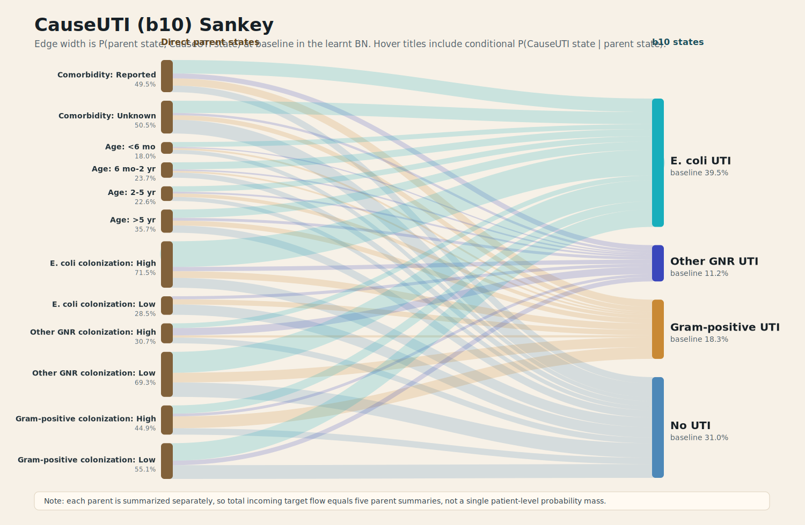

# CauseUTI (b10) Sankey flow

This Sankey summarizes the direct local network into `b10 / CauseUTI` from the learnt Ramsay BN.

## How To Read It

- Left side: direct parent states of `CauseUTI`.
- Right side: the four `CauseUTI` states: `EColi`, `OtherGramNeg`, `GramPos`, and `None`.
- Edge width: baseline joint flow `P(parent state, CauseUTI state)`.
- The SVG path tooltips include `P(CauseUTI state | parent state)`.

Because each parent is summarized separately, target-side incoming flow aggregates five parent summaries. It is meant as an educational local-node view, not as a single conserved patient trajectory.

Generated from `site/src/data/model.generated.json`, which was parsed from `Applied_BN_v2.2_learnt.dne`.
