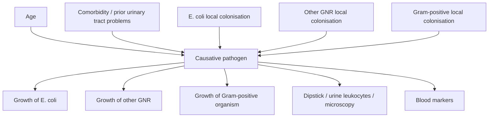

# Ramsay UTI node visualization concepts

Question: how should a clinician-facing tool present the Applied BN output node `Causative pathogen (b10)` when it has four states: UTI secondary to E. coli, no UTI, UTI secondary to other Gram-negative bacteria, and UTI secondary to Gram-positive bacteria?

## Paper anchors

Ramsay et al. built an Applied BN from an expert DAG plus prospective ED data for suspected pediatric UTI. The model was explicitly meant to support diagnosis and management in the ED, not only to predict a lab result. The Applied BN had 36 nodes, including 6 latent nodes.

The target node in the released learnt model is:

```text
CauseUTI / "Causative pathogen (b10)"
states: EColi, OtherGramNeg, GramPos, None
direct parents: Comorbidity, Age, E. coli local colonisation, other GNR local colonisation, Gram-positive local colonisation
```

Important nuance: direct parents are not the only clinically meaningful explanation. In actual use, evidence may flow backward from observed children or descendants such as culture growth, nitrites, leukocytes, microscopy, CRP, and antibiotic exposure. A good interface should therefore label the explanation layer as **drivers** or **evidence pathways**, not simply "parent contribution."

Ramsay et al. report that the main uncertain parameters driving the target were the overall UTI probability in the cohort and organism-specific pathogenicity. They specifically note uncertainty around Gram-positive pathogenicity, where growth is often treated as contamination. They used variance-based sensitivity analysis on high-uncertainty CPT parameters.

## What the ED doctor is trying to do

The visual system should not merely answer "what are the four probabilities?" It should help with one of these actions:

| Moment | Clinician action | Interface question |
|---|---|---|
| Before urine result | Decide whether empiric antibiotics or further testing is justified | Is the UTI branch alive enough to act now? |
| After dipstick / microscopy | Decide whether the evidence meaningfully changes management | Which evidence moved the posterior, and what is still missing? |
| After culture | Decide whether a culture result represents true UTI, contamination, or antibiotic-suppressed infection | Is this culture result congruent with the whole case? |
| Stewardship review | Decide whether to narrow, stop, or continue antibiotics | Is the model confident enough to support de-escalation? |
| Model audit | Decide whether the model output is trustworthy | Which assumptions could reverse the top diagnosis? |

## Design principle

Separate four layers:

1. **Posterior**: the current four-state probability vector.
2. **Evidence trace**: why the vector changed for this patient.
3. **Causal pathway**: infection vs contamination vs antibiotic suppression.
4. **Fragility**: sensitivity analysis and parameter uncertainty.

Trying to put all four into one chart will make the tool feel clever but unusable.

## View 1: Posterior quartet

This is the ED-default view. Four large state tiles, sorted by posterior probability, with the top state visually dominant.

```text
Causative pathogen now

E. coli UTI          46%  [############------]  uncertain
No UTI              31%  [########----------]
Other GNR UTI       17%  [####--------------]
Gram-positive UTI    6%  [#-----------------]  fragile assumption

Current stance: treat as possible UTI, but do not treat culture growth alone as proof.
```

Design details:

- Show the exact four numbers, but also show a **rank** and **margin** between first and second.
- Use a pale uncertainty band behind each bar when sensitivity analysis produces a plausible range.
- Show a small "rank fragile" badge if parameter uncertainty can swap the top two states.
- Include an action-adjacent sentence, but do not let the model silently prescribe antibiotics.

Best use: rapid ED sensemaking.

## View 2: Evidence ledger

A clinician usually wants to know "what made it say that?" A ledger is clearer than a force-directed graph for the main bedside screen.

```text
Evidence effect on E. coli UTI posterior

Starting cohort prior                 40%
Age / comorbidity                     +6
Current phenotype                     -4
Dipstick nitrite detected            +18
CRP high                             +10
Prior antibiotics                    +?  weakens culture reliability
E. coli grown in culture             +22
Contamination risk                   -15
Final posterior                       77%
```

For a four-state node, use a grouped ledger:

| Evidence block | E. coli UTI | No UTI | Other GNR UTI | Gram-positive UTI | Clinical gloss |
|---|---:|---:|---:|---:|---|
| Age/comorbidity | up | down | flat | flat | baseline susceptibility |
| Symptoms phenotype | flat | up | flat | flat | nonspecific presentation |
| Dipstick/microscopy | up | down | up | flat | inflammation plus organism clues |
| Culture growth | up | down | down | down | culture supports organism, but not perfectly |
| Antibiotics before ED | ambiguous | ambiguous | ambiguous | ambiguous | raises false-negative concern |
| Contamination risk | down | up | down | up/down | culture may not equal disease |

Implementation note: compute these as deltas from evidence ablation or sequential evidence entry. Do not call them causal effects unless the query truly uses an intervention.

Best use: immediate explanation and clinician trust.

## View 3: Local causal neighborhood

This should be a side panel rather than the whole interface. Put `Causative pathogen` in the center and show the local causal neighborhood.



Visual encoding:

- Parent nodes above, observed evidence nodes below.
- Solid edges for causal links preserved from the expert DAG.
- Dashed edges for non-causal approximations introduced in the Applied BN.
- Edge thickness for influence on the selected state.
- Edge color for direction of current evidence: supports, argues against, or explains discordance.
- Dotted halos for latent nodes and high-uncertainty parameters.

Best use: "show me the model" without dumping the entire 36-node BN.

## View 4: Infection-contamination-antibiotic pathway strip

This paper is not just a UTI classifier. Its clinical value is the split between true infection, specimen contamination, and antibiotic-suppressed culture. Make that visible.

```text
INFECTION PATHWAY          local colonisation -> invasion -> inflammation -> symptoms/labs
CONTAMINATION PATHWAY      collection method -> contamination risk -> culture growth
ANTIBIOTIC PATHWAY         antibiotics before ED -> suppressed growth / altered culture
```

For the current patient, each pathway becomes a lane:

| Lane | Current signal | What it means |
|---|---|---|
| Infection | high leukocytes, fever, CRP high | pushes toward true UTI |
| Contamination | clean catch, epithelial cells high | weakens culture specificity |
| Antibiotic suppression | antibiotics before ED | weakens negative culture |

Best use: culture interpretation. This is where the tool can say, "E. coli grew, but given contamination risk, the posterior for true E. coli UTI is only moderate."

## View 5: Scenario fan

Ramsay et al. present hypothetical scenarios where more information becomes available over time. Turn that into an interactive fan.

```text
Now
  |
  +-- nitrites detected --------> E. coli rises
  |
  +-- nitrites not detected ----> E. coli falls, no UTI rises
  |
  +-- CRP 80 -------------------> true infection rises
  |
  +-- E. coli culture positive -> E. coli rises, but contamination lane modifies it
```

Each branch should display the same four-state posterior quartet, so the doctor can see how a pending test would change the action.

Best use: "should I wait for CRP/microscopy/culture, or act now?"

## View 6: Sensitivity tornado

Use this for the model's uncertain construction assumptions. It should not be mixed up with patient-specific evidence.

```text
What model assumptions could move the E. coli UTI output?

Assumption varied                          E. coli posterior range
Overall UTI prevalence                     35% ---------------- 62%
E. coli pathogenicity                      41% ----------- 56%
Other GNR pathogenicity                    39% ------ 50%
Gram-positive pathogenicity                42% --- 48%
Contamination probability                  28% ---------------- 59%
Effect of prior antibiotics on culture     31% --------------- 60%
```

Better than a plain tornado: show whether each assumption can change the **decision**:

| Parameter family | Moves probability? | Can change top state? | Bedside label |
|---|---:|---:|---|
| Overall UTI prevalence | high | yes | model fragility |
| Organism pathogenicity | high | yes for organism differentiation | organism call fragile |
| Gram-positive pathogenicity | moderate | sometimes | interpret GPC with caution |
| Culture contamination risk | high | yes | culture-positive does not equal true UTI |

Best use: audit and "do I trust this?" moments.

## View 7: Probability simplex / uncertainty cloud

For high-dimensional probability space, a simplex is the cleanest abstraction.

Concept:

- Four corners: E. coli UTI, no UTI, other GNR UTI, Gram-positive UTI.
- Current posterior: one dot inside the tetrahedron or a 2D projected simplex.
- Sensitivity analysis: a cloud around the dot generated by varying uncertain CPT parameters.
- Decision regions: shaded zones where the same clinical action would be recommended.

Interpretation:

- Tight cloud far from a boundary: stable.
- Wide cloud crossing a boundary: model-sensitive, show "do not overtrust top state."
- Cloud drifting toward Gram-positive corner when Gram-positive pathogenicity is varied: the organism call is assumption-sensitive.

Best use: expert mode, model audit, teaching. Probably too abstract as the ED default, but powerful as an expandable "uncertainty map."

## View 8: Parent-state lattice

For model builders and clinicians who want to understand the CPT, show a small-multiple lattice:

```text
Rows: age group
Columns: comorbidity reported / unknown
Cell facets: E. coli local colonisation high/low, other GNR high/low, GPC high/low
Cell color: dominant b10 state
Cell opacity: entropy / uncertainty
Current patient: outlined cell
```

This makes the high-dimensional CPT readable as a terrain. It shows where the model believes "no UTI" dominates, where E. coli dominates, and where organism differentiation is poorly separated.

Best use: model QA, not bedside default.

## View 9: Evidence-to-action dashboard

Recommended v0 layout:

```text
--------------------------------------------------------------------------------
Patient context                         Causative pathogen now
age, sex, prior UTI/kidney problems     [four posterior bars + uncertainty bands]
collection method, antibiotics          action stance + rank-fragility badge
--------------------------------------------------------------------------------
Evidence drivers                        Local causal neighborhood
sequential ledger of posterior shifts   compact b10 Markov-blanket graph
--------------------------------------------------------------------------------
Scenario fan                            Sensitivity / fragility
pending tests and branch posteriors     top 3 assumptions that could reverse call
--------------------------------------------------------------------------------
```

This keeps the bedside workflow sane:

- first: the answer;
- second: why;
- third: what would change it;
- fourth: why the model may be fragile.

## Strong interaction ideas

- Hover `E. coli UTI`: highlight evidence supporting E. coli specifically and suppress non-E. coli clutter.
- Hover `No UTI`: highlight contamination and alternative-explanation signals.
- Click `Gram-positive UTI`: show a caution card because the paper notes high uncertainty around Gram-positive pathogenicity.
- Toggle "culture hidden": show what the model believed before culture returned.
- Toggle "antibiotics before ED ignored": show how much culture interpretation depends on antibiotic suppression.
- Press "what should I obtain next?": rank missing evidence by expected reduction in entropy or rank-reversal probability.
- Press "why not just culture?": show infection vs contamination vs antibiotic pathways side by side.

## Design warnings

- Do not present sensitivity analysis as "feature importance." VBSA is about uncertain model parameters, not necessarily patient-specific evidence.
- Do not show the whole BN by default. A 36-node graph is for audit, not ED action.
- Do not collapse `Other GNR` and `Gram-positive` if the decision involves antibiotic selection or contamination interpretation.
- Do not overstate organism differentiation. Ramsay et al. explicitly say the model is not yet ready for differentiating pathogens, even though it shows a way forward.
- Do not hide missingness. Missing nitrites, CRP, microscopy, or culture context should visibly affect the confidence layer.

## Sources

- Ramsay et al. 2022 article: https://link.springer.com/article/10.1186/s12874-022-01695-6
- Released Applied BN learnt model: https://osf.io/download/ywsj7/
- Released Applied BN dictionary: https://osf.io/download/uj2r8/
